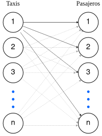
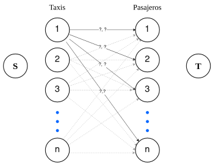
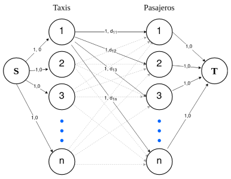

---
output:
  pdf_document: 
    highlight: zenburn
  html_document: default
---

#### Tecnología Digital V: Diseño de Algoritmos

# TP1 - Servicios de movilidad on-demand en tiempo real: estrategias y algoritmos

##### Autores: Federico Giorgi, Gastón Loza Montaña y Tomás Curzio.

## Introducción

### Contexto

En los últimos tiempos, el surgimiento masivo de plataformas colaborativas que conectan demanda con oferta ha transformado la manera en que interactuamos con diversos servicios, incluyendo el transporte. En este contexto, las aplicaciones colaborativas de movilidad privada, como Uber, Cabify, Didi, entre otras, han logrado un gran éxito al actuar como intermediarias entre pasajeros y conductores, brindando una experiencia más cómoda y eficiente.

El objetivo de este trabajo es analizar un aspecto fundamental del funcionamiento de estas plataformas: la asignación en tiempo real entre pasajeros y conductores. Con el crecimiento sostenido de usuarios de estas empresas, se ha ido complejizando el desafío de lograr emparejamientos efectivos ante requerimientos de experiencia del usuario cada vez más exigentes. A través de este análisis, buscamos ofrecer recomendaciones que permitan optimizar el sistema de emparejamiento y brindar una experiencia aún más satisfactoria tanto para los pasajeros como para los conductores de la plataforma.

### El problema (y la decisión a tomar)

El trabajo nos pone en el rol de consultores para una empresa que se dedica a dar servicios de movilidad, conectando a pasajeros con conductores. La empresa, dado un instante o intervalo pequeño de tiempo, en cierta área geográfica, tiene una cierta cantidad de pasajeros pidiendo un viaje, y otra cantidad de conductores disponibles. Nuestro objetivo es decidir, de manera inteligente, qué vehículo debe buscar a cada pasajero.

Para especificar mejor el problema, debemos tener en cuenta los datos que la empresa posee a su disposición previamente, y las simplificaciones que le realizamos al mismo.

Datos:

-   Para cada pasajero podemos asumir que tenemos:

    -   El instante en el que realizó el pedido.

    -   El origen del viaje (donde se realiza el *pick-up*).

    -   El destino del viaje o la distancia estimada del recorrido.

    -   La estimación de la tarifa a cobrar por el viaje.

-   Por cada conductor disponible para realizar un viaje podemos asumir que tenemos su localización en tiempo real.

Luego, oombinando ambas podemos asumir entonces que tenemos la distancia que llevaría a cada vehículo llegar a un potencial pasajero para comenzar el viaje.

Simplificaciones al problema:

-   Asumimos que la oferta y la demanda esta balanceada, es decir que hay misma cantidad de pasajeros que de conductores.

-   Asumimos que los pasajeros se encuentran ordenados de manera creciente según el instante en el que realizan el pedido.

-   Asumimos que ningun pasajero tiene prioridad sobre otro.

-   Asumimos que no es necesario lograr una distribución razonable de viajes a lo largo del día entre los distintos conductores.

## Estrategia FCFS

El problema puede ser resuelto desde distintos enfoques. El que actualmente utiliza la empresa que nos contrata es una idea muy natural que se basa en atender a los pasajeros por orden de llegada y para cada uno de ellos tomar la mejor decisión posible en el momento.

En otras palabras, utiliza el criterio de "First Come, First Served" y toma una decisión greedy para asignar el vehículo más cercano al pasajero que está siendo atendido en el momento. De esta forma, se toma la mejor decisión local para cada cliente pero ésta podría ser distinta a la mejor decisión global. 

Podemos dividir esta estrategia en los siguientes pasos:

1.  Considerar a los pasajeros por orden de llegada.

2.  Asignar al pasajero que llegó primero el vehículo más cercano.

3.  Remover este vehículo de los posibles a asignar (para que no haya un vehículo asignado a dos pasajeros) y remover al pasajero de la lista.

4.  Repetir hasta que no haya más pasajeros.

### Implementación para estrategia FCFS

Como parte del trabajo como consultores para la plataforma de intermediación de movilidad nos proponemos en primer lugar analizar la estrategia actual de la empresa para poder contar con resultados de rendimiento con los cuáles comparar las nuevas propuestas a la resolución del problema.

Para ello, siguiendo la idea de la estrategia explicada, realizamos una implementación de la misma en C++ que toma los datos de la distancia entre vehículos y pasajeros (en orden de llegada) en forma de una matriz y la recorre para asignarle a cada pasajero el vehículo disponible más cercano a su posición (*ver GreedySolver.cpp*).

Esta estrategia e implementación es totalmente válida. Sin embargo, si hay una cantidad de demanda significativa, es posible tomar otro enfoque, en el que en lugar de ir atendiendo por orden de llegada en tiempo real, se espera cierta cantidad de tiempo (algunos segundos) y se agrupa a los pasajeros que hayan pedido un viaje en ese lapso de tiempo, para luego tomar una decisión de asignación de vehículos sabiendo las localizaciones de todos. A esto se lo llama estrategia de "batching."

## Estrategia de Batching

Llamamos a ese grupo de clientes que pide el viaje en el lapso de tiempo en el que estamos esperando "batch", de ahí el nombre batching.

Con este batch podremos tomar una decisión global para el problema de asignación. Así, nuestro objetivo es de alguna manera realizar una asignación de vehículos a pasajeros de forma tal que la suma de las distancias recorridas de los vehículos para recoger a los pasajeros sea mínima. De esta forma, buscaremos no sólo disminuir el tiempo de espera colectivo de todos los pasajeros del batch sino también reducir los costos para los conductores teniendo que recorrer una menor distancia colectiva.

Notar que es posible que en algun momento elijamos un vehículo que no es el mas cercano a un pasajero. Sin embargo, esta decisión local no optima pero permite aportar a la mejor decisión global para minimizar la suma de distancias. Así, esta estrategia es totalmente distinta a la estrategia *greedy* vista anteriormente.

Para realizar esta asignación vamos a modelar el problema con grafos.

### Modelo para estrategia de Batching

Nuestro modelo utiliza la idea de resolver matching máximo en grafos bipartitos como un problema de flujo máximo.

Para construirlo, partimos de un grafo que contiene n nodos, representando a los taxis que forman nuestra particion $V_1$ y otros n nodos representando a los pasajeros que forman nuestra particion $V_2$, sabemos además que $n = \#V_1 = \#V_2$ por como se define el problema en las consignas del trabajo.

Posteriormente, conectamos cada nodo que representa a un taxi con los n nodos que representan a los pasajeros, representando que en principio podemos asignar cualquier taxi a cualquier pasajero. No conectamos taxis entre sí o pasajeros entre sí, por lo que nos queda un grafo bipartito.

Una vez obtenido el grafo es importante ver que no solo queremos realizar el matching máximo, si no que también queremos minimizar la distancia que recorren los taxis hasta recoger al pasajero. Para resolver esto, transformamos el problema de matching máximo en el grafo bipartito en un problema de flujo máximo y costo mínimo, siendo el costo que buscamos minimizar, la distancia mencionada. Para ello, debemos agregar al grafo que teniamos un nodo Source ($S$) y un nodo Sink ($T$) y asignar tanto capacidades como costos adecuados para representar nuestro problema.

Una vez agregados, conectamos $S$ con todos los taxis, dándole a cada arista capacidad 1, pues queremos que cada taxi se asigne a solo un pasajero, y costo 0, pues aún no se esta asignando ningún pasajero y no hay ninguna distancia que tomar. Luego, en las aristas que conectan a los taxis con los pasajeros, les asignamos capacidad 1, por el mismo motivo que antes y es que no queremos asignarle mas de un pasajero a los taxis (aunque es verdad que al haber elegido capacidad 1 en la conexión de $S$ con los taxis, esto ya estaba limitado y podríamos elegir cualquier capacidad $\geq 1$ ), y el costo será dado por la distancia desde el taxi al pasajero, es decir, la arista que conecta al i-ésimo taxi con el j-ésimo pasajero tendra capacidad 1 y costo $dist_{ij}$. Finalmente, conectamos los pasajeros a $T$, con capacidad 1 por el mismo motivo anterior (aunque otra vez, ya estaba limitado) y costo 0, pues interpretativamente esta conexión representa que el viaje terminó y ya no hay ninguna distancia (costo) a tener en cuenta.

*No se ve representado en las lineas punteadas pues saturaría la visualización pero cada linea punteada se conecta con capacidad 1 y costo* $dist_{ij}$, al igual que en las que se ven marcadas.

El flujo máximo del grafo será $n$, enviando una unidad de flujo por cada arista desde $S$ a los taxis, por lo tanto, cualquier combinación de taxis y pasajeros que "sacie" a todos los pasajeros, es decir, que haya un taxi asignado a cada pasajero nos dará el flujo máximo. Luego, si de estos flujos máximos buscamos el que tenga costo minimo obtendremos la combinación de taxis y pasajeros que sacia a todos los pasajeros y además minimiza la distancia recorrida por los taxis para recoger a los mismos. De esta manera, resolvemos el problema planteado en la estrategia de batching utilizando grafos de manera inteligente.

### Implementación para estrategia de Batching

Utilizando el modelo explicado, realizamos una implementación de esta estrategia utilizando la librería "or-tools", que nos provee una manera de resolver el problema de flujo máximo con costo mínimo dadas las siguientes estructuras de datos:

-   Un vector "start_nodes" y otro "end_nodes" donde el i-ésimo valor de start_nodes está conectado con el i-ésimo valor de end_nodes (con estos dos vectores se representan los arcos del grafo).

-   Un vector "capacities" con la capacidad de cada arco.

-   Un vector "cost_units" con el costo de cada arco.

-   Un vector "supplies" con los desbalances/imbalances de cada nodo.

Con esto, el problema de implementación de nuestro modelo y cálculo del flujo maximo con costo minimo se reduce a simplemente representar al grafo previamente explicado con esos 5 vectores.

¿Cómo hacemos esto para una instancia cualquiera?

**??

## Evaluación comparativa de las estrategias

Dado que una de las principales motivaciones de la formulación de un nuevo modelo (que tome una decisión global para la asignación entre vehículos y pasajeros) es la reducción de costos de los conductores y tiempos de espera de los pasajeros, nos proponemos, a través de experimentaciones, evaluar si efectivamente el nuevo modelo aporta en esa dirección.

### Experimentación

Teniendo en cuenta que la implementación de la estrategia de Bacthing toma a las distancias de recogida como los costos a minimizar, el principal criterio a considerar será ver cómo se comparan estos costos, computados como la suma de distancias para cada instancia, entre las distintas estrategias (*columnas \<estrategia\>\_cost en el dataframe de resultados*).

En segundo lugar, además de analizar los costos, buscaremos analizar el rendimiento económico de los conductores dado un ratio de rendimiento por km recorrido (*columnas \<estrategia\>\_benefit en el dataframe de resultados*). Este ratio se define como:

$$
r = \frac{tarifa\:(\$)}{dist.\:recogida + dist.\:viaje \:(km)}
$$

Por último, tomamos el tiempo de ejecución de cada estrategia utilizando la librería std::chrono de C++ (*columnas \<estrategia\>\_time en el dataframe de resultados*).

Para comparar el modelo propuesto con la estrategia de Batching con la versión actual de la empresa (FCFS) definimos las siguientes métricas:

-   %cost_gap: diferencia porcentual relativa de la estrategia batching sobre la greedy en base a los costos.

-   %time_gap: diferencia porcentual relativa de la estrategia batching sobre la greedy en base al tiempo de ejecución.

-   %yield_gap: diferencia porcentual relativa de la estrategia batching sobre la greedy en base al rendimiento económico de cada kilómetro recorrido por el conductor para concretar el viaje del pasajero asignado.

Para la evaluación de nuestra estrategia, tenemos a disposición cuatro conjuntos de instancias de diferentes tamaños (10, 100, 250 y 500) nos permiten observar los resultados de los diferentes algoritmos con una variedad de escenarios de asignación. Cada conjunto contiene diez instancias distintas para agregar diversidad a los escenarios considerados.

Las instancias fueron generadas en base a la información de los pasajeros se seleccionó al azar de los registros de viajes en taxi del área de Manhattan, Nueva York durante el mes de diciembre de 2018. Además, tanto la ubicación de los pasajeros como la de los vehículos se generaron de forma aleatoria utilizando información geoespacial sobre las zonas correspondientes.

### Discusión y análisis de resultados

Los resultados obtenidos de la evaluación comparativa entre la estrategia FCFS y la estrategia de batching se presentan en la siguiente tabla. Se indica para cada tamaño de instancia, el promedio de las métricas previamente detalladas. Se pueden ver los resultados desagregados en el Anexo I.

| n   | %cost_gap | %time_gap | %yield_gap |
|-----|-----------|-----------|------------|
| 10  | 14.74     | -4005.53  | -12.78     |
| 100 | 16.90     | -6840.77  | -4.00      |
| 250 | 17.32     | -5425.12  | 1.04       |
| 500 | 14.57     | -6527.45  | 16.67      |

Estos resultados basados en las métricas definidas anteriormente nos permiten evaluar el desempeño de ambas estrategias en términos de costos (tanto viaje de conductores y tiempo de espera de los pasajeros), tiempo de ejecución y rendimiento económico para los conductores.

En cuanto a los costos, observamos que para todas las instancias evaluadas se obtiene una mejora significativa en torno al 15%, lo que indica una reducción en los costos totales al asignar los vehículos con las estrategia de batching. Se puede notar que las mejoras relativas varían dependiendo de los tamaños de las instancias entre un 14.57% y un 17.32%. Notando los resultados podríamos inferir que ya cuando se experimenta con un matching entre 500 conductores y 500 pasajeros, la mejora del nuevo algoritmo con respecto al actual comienza disminuir. Sin embargo, considerando que los "bacth" se encontrarán acotados la mejora es consistente con el objetivo de resolución del problema propuesto.

A pesar de la mejora en términos de costos, al analizar el tiempo de ejecución se observa que los resultados muestran un %time_gap negativo en todas las instancias evaluadas. Esto indica que el tiempo de ejecución de la estrategia de batching es mayor en comparación con la estrategia FCFS. Los porcentajes son considerablemente altos y varían entre -4005.53% y -6527.45%, lo que demuestra un empeoramiento significativo en la eficiencia del proceso de asignación al utilizar la estrategia de batching en lugar de la estrategia FCFS. A continuación en la Figura 5, se puede apreciar como el tiempo de ejecución de la nueva estrategia crece considerablemente más rápido a medida que aumenta el tamaño de la muestra a diferencia de la versión actual. Sin embargo, siguen siendo tiempos de ejecución casi imperceptibles.

Por otro lado, en relación a la diferencia relativa en términos del rendimiento económico por kilómetro recorrido, encontramos resultados mixtos. En las instancias de menor tamaño (10 y 100), se observa una disminución en el rendimiento económico con la estrategia de batching. Sin embargo, en las instancias de mayor tamaño (250 y 500), se obtiene un aumento del rendimiento económico en comparación con la estrategia FCFS. Dado que el modelo de la estrategia batching tiene como función objetivo la minimización de la suma de distancias y no así el rendimiento económico de los conductores, en principio no podríamos explicar facilmente a que se deben estos resultados. De todas formas, podríamos pensar que tiene que ver con el tamaño del batch. Tal vez, ante una mayor disponibilidad de asignaciones posibles, minimizar las distancias de recogida permite una mejor distribución de los viajes y una mayor eficiencia en la distancia total recorrida por los conductores.

En resumen, los resultados indican que la estrategia de batching proporciona mejoras significativas en términos de la distancia colectiva de recogida de pasajeros que se traducirá también en menos tiempo de espera para los pasajeros. Además, si bien los tiempos de ejecución del nuevo modelo crecen exponencialemente con el tamaño de entrada, esto no debería ser un problema si se mantienen a los batch limitados en cantidades clientes. Sin embargo, el impacto en el rendimiento económico de los conductores puede variar según el tamaño del conjunto de instancias.

### Limitaciones y posibles extensiones

Como notamos, si bien la nueva estrategia propuesta aporta al objetivo reducir las distancias de búsqueda de los pasajeros y sus tiempos de espera existen ciertas limitaciones.

En particular, tal cual observamos, el rendimiento económico por *km* recorrido no es superior en ninguna estrategia con respecto a la otra. Muchas veces, este factor es de gran relevancia para los conductores ya que se oberva que en ocasiones se les asignan viajes que requieren recorrer distancias largas para recoger al pasajero, para luego hacer un viaje de distancia corta en comparación. Esto hace que la relación entre el beneficio (dado por la tarifa del viaje del pasajero) tenga poca relación con el costo asociado a la búsquede de ese cliente por parte del conductor. 

Además, es importante resaltar que si bien estos resultados se obtuvieron utilizando conjuntos de datos tomados de información real, la aplicabilidad de estos resultados puede variar en diferentes contextos y ubicaciones geográficas. Uno de los aspectos tal vez más relevantes que este modelo está obviando del contexto es el tráfico. 

## Estrategia Alternativa

- misma idea de batching pero con distinto costo
  
### Modelo para estrategia alternativa

- inversión del ratio r para minimizar --> explicar 

### Implementación para estrategia alternativa
